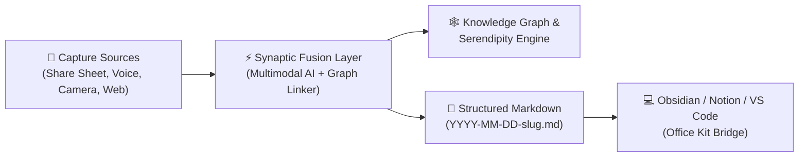

# 🧠 MindMesh AI

<div align="center">

[](https://github.com/MdTowfikomer/MindMesh-AI/releases/latest/download/app-release.apk)
[](https://github.com/MdTowfikomer/MindMesh-AI/releases)
[](https://expo.dev)
[](https://reactnative.dev)
[](LICENSE)

**Turn scattered screenshots, fleeting voice notes, and social bookmarks into an interconnected, living knowledge graph.**

*Engineered with an on-device first philosophy, ambient AI synthesis, and instant export to Obsidian and Notion.*

</div>

---

## 🧭 Executive Summary: Why MindMesh?

### 1. Is the App Idea Clear?
**Yes.** MindMesh is your **ambient cognitive copilot and second brain**. 

Instead of letting ideas, bookmarks, voice notes, and screenshots die in separate silos, MindMesh automatically connects the dots between what you just captured and everything you already know. It synthesizes incoming media into structured, linked **Markdown (`.md`) notes** ready for your personal knowledge base.



---

### 2. Does It Solve a Real Problem?
**Yes: The "Save Later" Cemetery & Information Fragmentation.**

* **The Problem:** Modern knowledge workers, researchers, and students bookmark hundreds of tweets, take quick screenshots of slides/whiteboards, and record rushed voice memos across a dozen different apps. Over 80% of saved bookmarks and screenshots are never opened again because:
  1. They have no context attached.
  2. They are disconnected from current projects and existing notes.
  3. Organizing them requires exhausting manual effort.
* **The MindMesh Solution:** 
  * **Zero-Friction Ingestion:** 1-tap capture via the native Android Share Sheet, a full-screen camera viewfinder, or voice memo recorder.
  * **Autonomous Contextualization:** AI extracts text (OCR), transcribes speech (Whisper), classifies core concepts, and auto-tags topics.
  * **Proactive Connection:** The engine discovers non-obvious links across your past memories without you having to organize folders or tags manually.

---

### 3. Is It Useful & Interesting?
**Yes: It transforms passive hoarding into active thinking.**

* **The Serendipity Engine:** Most note apps are passive databases—you only find what you explicitly search for. MindMesh introduces a **Serendipity Engine** that proactively surfaces unexpected connections between new inputs and thoughts recorded weeks ago.
* **Instant Markdown Synthesis:** Automatically drafts clean, GitHub-Flavored Markdown files adhering to the deterministic `YYYY-MM-DD-[topic-slug].md` format, populated with key takeaways, verbatim citations, and actionable next steps.
* **Hybrid Edge & BYOK Architecture:** Zero vendor lock-in. Store knowledge locally in SQLite with full offline capability, and power intelligence with Bring-Your-Own-Key (BYOK) for Google Gemini, Groq Whisper, OpenAI, or local on-device SLMs.

---

### 4. Does It Create a Compelling User Experience?
**Yes: Built with CyberLuxury aesthetics and zero latency.**

* **Modern Dark CyberLuxury UI:** Fluid transitions powered by React Native Reanimated 4 and custom haptic acoustics designed for focus and flow.
* **WhatsApp-Grade Camera Capture:** Full-screen camera viewfinder with real-time flash toggles, rapid camera-roll thumbnail carousel, AI enhancement wand, and double-ring shutter.
* **Ambient Sound & Haptics:** Custom tactile feedback on thought capture, synaptic synthesis, and graph navigation.

---

## ⚡ Key Features

### 🎙️ Instant Multimodal Capture
- **Voice Memos with Whisper AI:** Speak your thoughts naturally; MindMesh transcribes audio in near real-time, extracts intent, and attaches timestamps.
- **Visual Capture & Document Scanner:** Live camera view with rapid gallery thumbnail selection, camera flip, flash modes, and AI document enhancement.
- **Android Share Sheet Ingestion:** Share articles, tweets, YouTube links, and images directly from any Android app straight into MindMesh with a single tap.
- **PDF & Document Reader:** Ingest research papers and whitepapers, parsing metadata and generating TL;DR executive summaries.

### 🧠 The Synaptic Fusion & Serendipity Engine
- **Autonomous Semantic Linking:** Finds conceptual relationships across disparate notes (e.g., connects an audio thought about "vector search" with a camera capture of a whiteboard from last week).
- **Interactive Knowledge Graph:** Dynamic visual mesh mapping clusters, tags, and conceptual neighborhoods.
- **Discovery Cards:** Ambient daily cards surfacing forgotten ideas whose relevance has resurfaced.

### 📝 Markdown-First Ecosystem
- **Clean Standardized Filenames:** Notes are deterministically generated as:
  ```bash
  YYYY-MM-DD-[semantic-topic-slug].md
  ```
  *(e.g., `2026-09-20-agentic-rag-architectures.md`)*
- **Universal Portability:** Drop generated `.md` files straight into Obsidian, Notion, VS Code, Logseq, or GitHub without proprietary lock-in.

### 🔒 Privacy-First & BYOK (Bring Your Own Key)
- **Local SQLite Vault:** All core thoughts, transcriptions, and graph relationships live securely on your device.
- **Encrypted Key Storage:** Secure on-device key management for AI providers (Google Gemini, Groq, OpenAI).
- **Zero Data Mining:** Your notes and thoughts are never used to train global public models.

---

## 🏗️ System Architecture

```
                      ┌────────────────────────────────────────┐
                      │          Capture Ingestion             │
                      │  Share Sheet | Voice | Camera | File   │
                      └──────────────────┬─────────────────────┘
                                         │
                                         ▼
                      ┌────────────────────────────────────────┐
                      │          Processing Pipeline           │
                      │  Whisper Audio  │  Vision OCR & AI     │
                      └──────────────────┬─────────────────────┘
                                         │
                                         ▼
                      ┌────────────────────────────────────────┐
                      │         Synaptic Fusion Layer          │
                      │  Tag Extraction │ Semantic Clustering  │
                      └──────────────────┬─────────────────────┘
                                         │
                    ┌────────────────────┴────────────────────┐
                    ▼                                         ▼
        ┌────────────────────────┐               ┌────────────────────────┐
        │  On-Device SQLite DB   │               │   Serendipity Engine   │
        │  Encrypted Vault &     │               │   Autonomous Knowledge │
        │  Graph Nodes/Edges     │               │   Bridge Discovery     │
        └───────────┬────────────┘               └───────────┬────────────┘
                    │                                         │
                    └────────────────────┬────────────────────┘
                                         │
                                         ▼
                      ┌────────────────────────────────────────┐
                      │           Export & Interface           │
                      │  Markdown (.md) │ Graph UI │ OfficeKit │
                      └────────────────────────────────────────┘
```

---

## 📱 Installation & Setup

### Download Pre-Built Android APK
Get the standalone release APK directly on your phone:
👉 **[Download Latest app-release.apk](https://github.com/MdTowfikomer/MindMesh-AI/releases/latest/download/app-release.apk)**

1. Download the APK onto your Android device.
2. Tap the file to install (allow *"Install unknown apps"* if prompted).
3. Open **MindMesh AI**, paste your Gemini or Groq API key in Settings (or use local mode), and start capturing!

---

### Local Development Setup

#### Prerequisites
- **Node.js**: v18 or higher (v20+ recommended)
- **Package Manager**: npm or yarn
- **Mobile Environment**: Expo Go (SDK 57) or Android Studio / Xcode for bare builds

#### 1. Clone the repository
```bash
git clone https://github.com/MdTowfikomer/MindMesh-AI.git
cd MindMesh-AI
```

#### 2. Install dependencies
```bash
npm install
```

#### 3. Start Expo development server
```bash
npx expo start
```
Scan the QR code with **Expo Go** on Android/iOS, or press `a` for Android Emulator.

#### 4. Type Checking & Verification
```bash
npx tsc --noEmit
```

---

## 🛠️ Technology Stack

| Layer | Technology | Purpose |
| :--- | :--- | :--- |
| **Framework** | Expo SDK 57 (React Native 0.86.3, React 19) | Cross-platform runtime & modern routing |
| **Routing** | Expo Router v4 (`typedRoutes`) | File-based typed native navigation |
| **Local Storage** | Expo SQLite | Encrypted on-device relational database |
| **Camera & Media** | `expo-camera`, `expo-media-library` | Full-screen viewfinder & local asset picker |
| **Audio Engine** | `expo-audio`, `expo-av` | High-fidelity recording & acoustic feedback |
| **Animation & UI** | React Native Reanimated 4, Skia | 60/120 FPS fluid physics & cyber aesthetic |
| **State Management**| Zustand | Reactive store for memories, graph, and UI |
| **AI Providers** | Google Gemini (3.5 & 2.5 Flash), Groq Whisper | Multimodal vision, OCR, and speech transcription |

---

## 🗺️ Roadmap

- [x] **SDK 57 Core Upgrade:** React Native 0.86, Expo Router, and typed navigation.
- [x] **Full-Screen Camera Capture:** WhatsApp-style viewfinder with recent roll carousel and flash toggle.
- [x] **BYOK Architecture:** Secure local credential management for Gemini and Groq.
- [x] **Serendipity Engine:** Non-obvious knowledge clustering and noise filtering.
- [ ] **On-Device SLM Integration:** Complete offline inference powered by quantized small language models.
- [ ] **Office Kit Desktop Handoff:** Automatic wireless folder mirroring to desktop Obsidian vaults.
- [ ] **Interactive 3D Graph Mesh:** Spatial graph exploration using React Native Skia.

---

## 📄 License & Attribution

Distributed under the **MIT License**. See `LICENSE` for more information.

Designed & Developed with ❤️ by **[Md Towfik Omer](https://github.com/MdTowfikomer)**.
