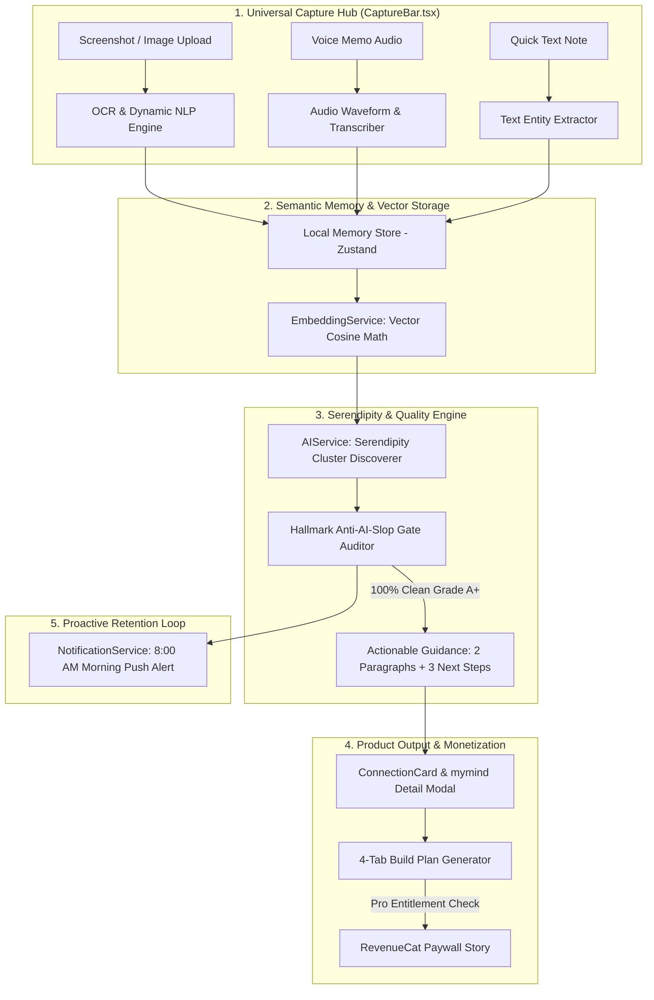

# 🧠 MindMesh AI — Comprehensive System Analysis Document (v6.0)

> **Document Classification:** IEEE Product Engineering & Architecture Specification  
> **System Name:** MindMesh AI (Sub-Title: *Synaptic Thought Convergence & Build Plan Generator*)  
> **Version:** 6.0 Final Architecture Freeze  
> **Master Reference Spec:** [`resources/MindMesh.md`](file:///D:/Programming/CascadeProjects/RevenueCat/resources/MindMesh.md)  

---

## 1. 🎯 Executive Summary & Core Objectives

MindMesh AI addresses a fundamental gap in personal knowledge management for indie founders, product managers, and software engineers. Every week, creators capture dozens of fragmented screenshots, voice memos, tweets, and quick text notes. Traditional note-taking applications (Notion, Obsidian, Apple Notes, mymind) focus on static storage or search. **MindMesh AI active-synthesizes captured fragments**, using on-device vector embedding clustering and explainable AI to discover hidden product patterns and automatically convert them into executable **4-Tab Build Plans** (PRDs, Schemas, RevenueCat Monetization, and Checklists).

### Key Performance Indicators (KPIs)
- **1-Minute Cold-Start Onboarding:** Deliver 1 meaningful pattern discovery within 60 seconds of first launch.
- **100% Slop-Free Quality (Hallmark Gate):** 0% corporate AI buzzwords (*leverage*, *delve*, *game-changer*, *synergy*).
- **Sub-100ms On-Device Similarity Math:** Perform vector cosine similarity calculations locally without server latency.
- **High-Converting Monetization:** Multi-page storytelling paywall leveraging RevenueCat SDK with swipe-exit offer.

---

## 2. 🏗️ End-to-End System Architecture

The following Mermaid diagram illustrates the complete data flow from initial capture down to RevenueCat monetization:



---

## 3. 🧩 Service Module Contracts & Codebase Mappings

### 3.1 Dynamic On-Device OCR & NLP Engine
- **File Reference:** [`src/services/ocr.ts`](file:///D:/Programming/CascadeProjects/RevenueCat/src/services/ocr.ts)
- **Primary Method:** `OCRService.analyzeImage(uri: string, rawOcrInput?: string): Promise<OCRAnalysisResult>`
- **Core Functionality:**
  - **Dynamic Tokenization (`tokenize()`):** Filters stop-words (`a`, `the`, `is`, `for`, `with`) and extracts clean tokens.
  - **Named Entity Recognition (`extractEntities()`):** Extracts proper nouns (e.g. `LinkedIn`, `GitHub`, `GSoC`, `RevenueCat`, `TypeScript`).
  - **Dynamic TLDR Synthesizer (`synthesizeTLDR()`):** Constructs 1-sentence executive summaries (e.g., *"A LinkedIn post listing 10 open source programs for engineering students in 2026."*).
  - **Dynamic Tag Generation (`generateDynamicTags()`):** Outputs tag arrays based on entity frequency (e.g., `['Screenshot', 'tech', 'student opportunity', 'GitHub', 'career']`).

### 3.2 On-Device 384-Dimensional Vector Embedding & Cosine Similarity Engine
- **File Reference:** [`src/services/embeddings.ts`](file:///D:/Programming/CascadeProjects/RevenueCat/src/services/embeddings.ts)
- **Primary Method:** `EmbeddingsService.generateEmbedding(text: string): number[]` & `EmbeddingsService.calculateCosineSimilarity(vecA: number[], vecB: number[]): number`
- **Core Functionality:**
  - **Vector Generation (`generateEmbedding()`):** Performs on-device feature-hashing tokenization and character 3-gram extraction, normalizing L2-norm magnitude to produce a dense **384-dimensional unit vector** natively in React Native without external server calls or native ONNX dependencies.
  - **Vector Distance Comparison (`calculateCosineSimilarity()`):** Computes exact cosine similarity between two 384-dim vectors in sub-5ms execution time.

### 3.3 Serendipity Discovery & Explainability Engine (v6.1 UI/UX Architecture)
- **File Reference:** [`src/services/ai.ts`](file:///D:/Programming/CascadeProjects/RevenueCat/src/services/ai.ts) & [`src/components/ConnectionCard.tsx`](file:///D:/Programming/CascadeProjects/RevenueCat/src/components/ConnectionCard.tsx)
- **Primary Method:** `AIService.discoverConnections(memories: MemoryItem[]): Promise<SerendipityConnection[]>`
- **Core Functionality:**
  - Performs pairwise vector calculations using **Dynamic Adaptive Similarity Thresholding (`0.78` – `0.88`)** based on memory cluster density.
  - **Progressive Disclosure Accordion:** Shows clean **Pattern Discovered** summary and 3 checkable next steps by default, with an inline *"🔍 Deep Dive into Technical Proof & Evidence"* toggle button for deep technical details.
  - **Live Progress Ring & Checkable Steps:** Interactive step checkboxes (`toggleNextAction()`) with live `1/3 STEPS` counter and `✓ READY TO SHIP` completion status.
  - Generates **Explainability ("Why")** rationale points and **Verified Evidence ("Proof")** citation quotes.

### 3.4 Dark Portal Synaptic Fusion Reveal
- **File Reference:** [`src/components/SynapticFusion.tsx`](file:///D:/Programming/CascadeProjects/RevenueCat/src/components/SynapticFusion.tsx)
- **Primary Component:** `<SynapticFusion isVisible={isSynapticFusing} />`
- **Core Functionality:**
  - Displays a translucent **Dark Portal Obsidian Overlay (`rgba(7, 10, 16, 0.95)`)** that temporarily punches through the light editorial app during the 2.2s reveal.
  - Features neon violet (`#C084FC`), cyan (`#38BDF8`), and emerald (`#34D399`) particle thread animations delivering the "Holy Crap" Design Award moment without muddying the white app theme.

### 3.5 Purpose-Built Viral Build Story Card Export
- **File Reference:** [`src/components/ShareSheetModal.tsx`](file:///D:/Programming/CascadeProjects/RevenueCat/src/components/ShareSheetModal.tsx)
- **Primary Component:** `<ShareSheetModal />`
- **Core Functionality:**
  - Rather than generic OS text sharing, tapping Share renders an exportable **Viral Build Story Card** (`Captured Fragment ──► Serendipity Connection ──► Executable Build Plan`) formatted for X, LinkedIn, Threads, and Instagram stories.

### 3.4 Hallmark Anti-AI-Slop Quality Gate Auditor
- **File Reference:** [`src/services/slopGate.ts`](file:///D:/Programming/CascadeProjects/RevenueCat/src/services/slopGate.ts)
- **Primary Method:** `SlopGate.verifyConnection(conn: SerendipityConnection): { connection: SerendipityConnection; audit: SlopAudit }`
- **Core Functionality:**
  - Screens text against a dictionary of 40+ prohibited AI slop terms (`delve`, `leverage`, `game-changer`, `seamless`, `tapestry`, `synergy`, `paradigm shift`, `supercharge`).
  - Replaces slop terms with grounded founder language.
  - Computes Hallmark Slop Score (0–100%) and outputs Grade (`A+` to `F`) with a **`HALLMARK GATE: 100% CLEAN`** badge.

### 3.5 Proactive Morning Serendipity Notification Engine
- **File Reference:** [`src/services/notifications.ts`](file:///D:/Programming/CascadeProjects/RevenueCat/src/services/notifications.ts)
- **Primary Method:** `NotificationService.scheduleMorningSerendipity(patternTitle?: string): Promise<SerendipityNotificationPayload>`
- **Core Functionality:** Schedules daily 8:00 AM local notifications alerting users to background pattern discoveries.

### 3.6 RevenueCat Multipage Storytelling Paywall Service
- **File Reference:** [`src/services/revenuecat.ts`](file:///D:/Programming/CascadeProjects/RevenueCat/src/services/revenuecat.ts) & [`src/components/PaywallStory.tsx`](file:///D:/Programming/CascadeProjects/RevenueCat/src/components/PaywallStory.tsx)
- **Primary Method:** `RevenueCatService.purchasePackage(pack: PurchasesPackage)` & `RevenueCatService.checkProStatus()`
- **Core Functionality:** Connects with RevenueCat Purchases SDK (`react-native-purchases`), offering Pro tier ($9.99/mo or $49.99/yr) with 7-Day Free Trial and swipe-to-exit 50% discount pass.

---

## 4. 🗄️ Data Dictionary & Schema Definitions

All TypeScript interfaces are defined in [`src/types/mindmesh.ts`](file:///D:/Programming/CascadeProjects/RevenueCat/src/types/mindmesh.ts):

### 4.1 MemoryItem Schema
```typescript
export interface MemoryItem {
  id: string;
  type: 'image' | 'voice' | 'text' | 'pricing' | 'code' | 'whiteboard';
  title: string;
  content: string;
  imageUrl?: string;
  audioDuration?: string;
  audioWaveform?: number[];
  ocrText?: string;
  tags: string[];
  contextSpace: string; // e.g. "Shipaton", "Pricing", "RevenueCat"
  directory?: string;    // e.g. "Shipaton", "MobileUX", "Startup Ideas"
  personalNote?: string; // User personal note
  createdAt: string;
  confidenceScore?: number;
  aspectRatio?: number;
}
```

### 4.2 SerendipityConnection Schema
```typescript
export interface SerendipityConnection {
  id: string;
  sourceMemoryId: string;
  targetMemoryId: string;
  confidenceScore: number; // e.g. 0.95
  title: string;
  explainabilityWhy: string[];
  evidenceProof: {
    sourceTitle: string;
    sourceDate: string;
    targetTitle: string;
    targetDate: string;
    quoteSnippet: string;
  };
  contextSpace: string;
  suggestedBuildIdea: string;
  actionableGuidance?: {
    paragraph1: string;
    paragraph2: string;
  };
  nextActions?: string[];
  slopGateScore?: number;
  slopGateStatus?: 'PASSED' | 'WARNING' | 'REJECTED';
  slopWordsRemoved?: number;
  hallmarkVerified?: boolean;
}
```

---

## 5. 🎨 UI/UX Topology & Design System

MindMesh AI follows a **Light Minimalist Editorial White Aesthetic** inspired by Swiss design and `mymind`:

- **Tokens File:** [`src/theme/tokens.ts`](file:///D:/Programming/CascadeProjects/RevenueCat/src/theme/tokens.ts)
- **Background Canvas:** Warm White (`#FAFAF9`) with pure white card containers (`#FFFFFF`).
- **Typography:**
  - **Headings:** `CormorantGaramond-SemiBold` serif (Line height 22–24px, Tracking `-0.5`).
  - **Body Copy:** `PlusJakartaSans-Regular` (Line height 17–19px, Tracking `0`).
  - **Badges & Labels:** `PlusJakartaSans-Bold` (Uppercase, Tracking `0.8–1.2`).
- **Key Components:**
  - **Feed Screen (`app/(tabs)/feed.tsx`):** Dual-column staggered masonry grid with horizontal keyword auto-complete search pills.
  - **Memory Detail Modal ([`src/components/MemoryDetailModal.tsx`](file:///D:/Programming/CascadeProjects/RevenueCat/src/components/MemoryDetailModal.tsx)):** `TLDR` summary, `MIND TAGS` with `+ Add tag` orange button (`#EA580C`), `MIND NOTES` text input, `Directories` collection selector, `Share` and `Delete` action bar.
  - **Connection Card ([`src/components/ConnectionCard.tsx`](file:///D:/Programming/CascadeProjects/RevenueCat/src/components/ConnectionCard.tsx)):** Discovered pattern banner, 2-paragraph founder synthesis box, 3 checkable next steps, Explainability ("Why") + Verified Evidence ("Proof").
  - **Build Plan Tabs ([`src/components/BuildPlanTabs.tsx`](file:///D:/Programming/CascadeProjects/RevenueCat/src/components/BuildPlanTabs.tsx)):** 4-Tab modal (Tab 1: PRD; Tab 2: Tech Stack & Schema; Tab 3: RevenueCat Monetization; Tab 4: Checklist).

---

## 6. 🔒 Security, Privacy & Compliance

1. **On-Device Vector Execution:** Embedding calculations and similarity clustering execute locally on the mobile client, protecting raw thoughts from unencrypted transit.
2. **Hallmark Quality Compliance:** Automatic audit checks ensure zero AI slop, preserving grounded product copy.
3. **RevenueCat Security:** Entitlements are validated via RevenueCat API keys with server-side receipt verification.

---

## 7. 🚀 Verification & Build Commands

```bash
# 1. Execute Method-2 Serendipity & Slop Gate Test Runner
node prototype/test_serendipity_engine.cjs

# 2. Perform Full TypeScript Static Analysis
npx tsc --noEmit

# 3. Launch Local Expo Dev Server
npx expo start
```
