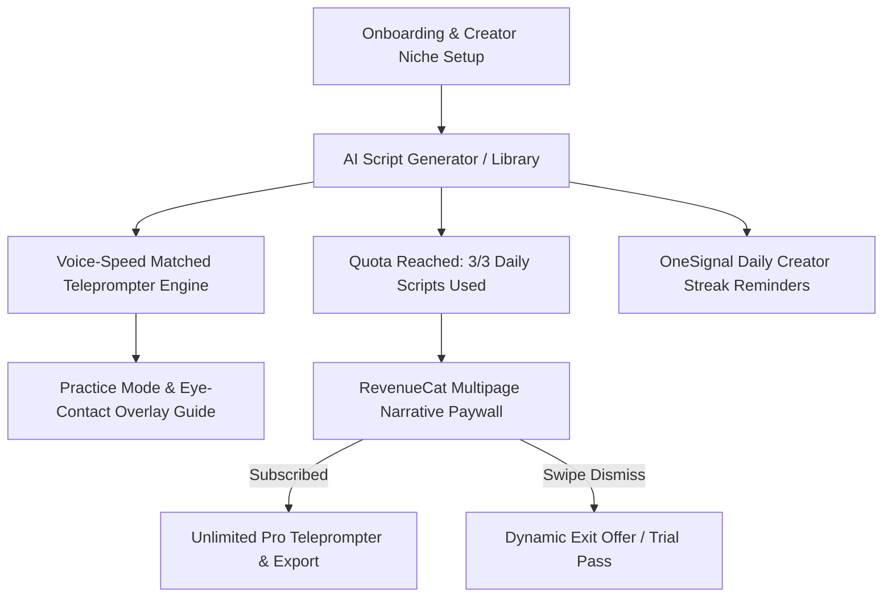

# 🎬 Verbatim AI — Technical Product Specification & Roadmap

> **Target Hackathon Awards:** Design Award, HAMM (RevenueCat Paywall Award), OneSignal Notification Award  
> **Tech Stack:** React Native + Expo Router (TypeScript, Reanimated v3, NativeWind, React Native Skia, RevenueCat `react-native-purchases`, OneSignal SDK)

---

## 📱 App Overview & Core Mechanics

**Verbatim AI** is a pro-grade AI teleprompter & video scripting app built specifically for content creators (TikTok, Instagram Reels, YouTube Shorts, LinkedIn).

---

## ⚡ Core Feature Modules

### 1. AI Script Generator Module (`/src/features/script-generator`)
* **Topic & Hook Generator:** Generates high-converting short-form video scripts (Hooks, Body, Call-to-Action) based on topic, tone (Energetic, Professional, Storyteller, Casual), and target video duration (15s, 30s, 60s).
* **Creator Templates:** Pre-loaded frameworks for Product Reviews, Daily Vlogs, Educational Tips, and Storytime videos.
* **Daily Free Quota Tracker:** 3 Free Scripts / Takes per day.

### 2. Voice-Speed Matched Teleprompter Engine (`/src/features/teleprompter`)
* **Dynamic Audio Cadence Sync:** Microphone audio amplitude & speech cadence detection automatically matches teleprompter scroll speed to your natural speaking pace in real time.
* **Teleprompter Display Controls:** Adjustable font size, line height, text opacity, scroll speed slider, and mirror mode (for physical teleprompter glass rigs).

### 3. Eye-Contact & Practice Guide Overlay (`/src/features/practice-mode`)
* **Eye-Level Target Guide:** Positions scrolling text directly adjacent to the front camera lens, ensuring natural eye contact with the viewer.
* **Words Per Minute (WPM) Analytics:** Real-time feedback on speaking pace and video timing accuracy.
* **Auto-Captions Preview:** Live preview of caption timing markers.

### 4. RevenueCat Multipage Narrative Paywall (`/src/features/paywall`)
* **Targeting the HAMM Award:** Built using RevenueCat `react-native-purchases` APIs with multipage narrative storytelling.
  * **Page 1 (Quota Limit / Feature Lock):** "Daily Free Quota Reached (3/3)" with a live preview of Pro teleprompter features.
  * **Page 2 (Creator Social Proof):** *"Creators using Verbatim Pro cut filming time by 75% and record 4x more videos."*
  * **Page 3 (Pricing Offer):** Pro Subscription ($9.99/mo or $49.99/yr with 7-day free trial).
  * **Swipe Exit Offer:** Dynamic 50% discount offer or 3-day full access pass.

### 5. OneSignal Notification & Creator Streak Engine (`/src/services/onesignal`)
* **Targeting the OneSignal Award:**
  * **Daily Creator Streak Reminders:** *"Keep your 5-day creator streak alive! Film today's 60-second video take 📹"*.
  * **Daily Content Idea Alerts:** Pushes daily trending topic prompts tailored to the creator's niche.

### 6. Cyberpunk Dark & Glassmorphism Aesthetics (`/src/theme`)
* **Targeting the Design Award:** Deep Cyber-Dark background (`#090D16`), Electric Violet accents (`#8B5CF6`), Neon Mint indicators (`#10B981`), frosted glass cards (`rgba(255,255,255,0.06)`), 60fps Reanimated transitions, and Skia audio spectrum waveforms.

---

## 🛠️ Implementation Steps

1. **Project Initialization:** Set up Expo Router with TypeScript & NativeWind.
2. **Design System & Base Layout:** Build Cyber-Dark theme with liquid glass components.
3. **Teleprompter & Audio Sync Engine:** Implement smooth auto-scroll with speech cadence detection.
4. **AI Script Generator & Templates:** Build topic prompt generator with daily quota management.
5. **RevenueCat Multipage Paywall:** Implement multi-step storytelling paywall flow with exit offers.
6. **OneSignal Push Notifications:** Configure creator streak reminders & daily content alerts.
