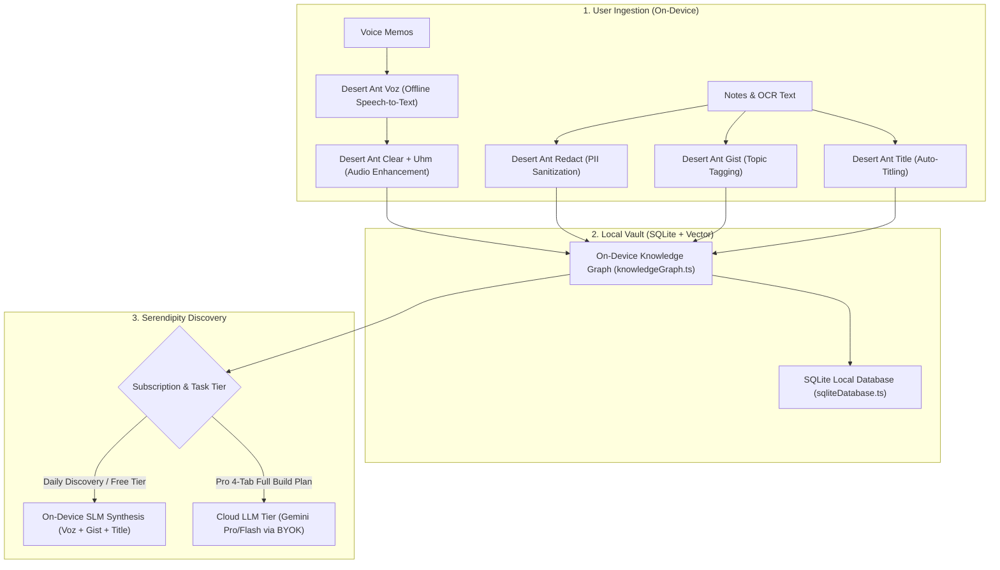

# 🐜 Desert Ant Labs SLM Migration Plan

> **Project**: MindMesh  
> **Objective**: Replace cloud API dependencies with on-device Small Language Models (SLMs) from [Desert Ant Labs](https://desertant.com/) to achieve 100% offline intelligence, zero marginal token costs, and enhanced privacy.  
> **Target Event**: RevenueCat Shipathon 2026 — Next-Gen Award Submission  
> **Document Date**: September 2026

---

## 1. Executive Summary

MindMesh currently depends on several cloud API endpoints (Groq Whisper, Gemini Cloud API, Scrapers) for transcription, summarization, and tagging. While effective, cloud APIs introduce:
1. **Recurring API costs** that eat into RevenueCat subscription margins.
2. **Network latency** and hard offline failures (airplanes, subways, poor connectivity).
3. **Privacy concerns** when founders save proprietary startup notes and secrets.

By adopting **Desert Ant Labs on-device SLMs** (free up to 100k monthly devices, zero inference tokens), MindMesh can eliminate **~80% of external API calls**, running daily captures, voice transcriptions, and smart tagging 100% on the device hardware.

---

## 2. Current External API Audit vs. Desert Ant Replacement Matrix

| MindMesh Feature | Current Implementation & File | Desert Ant SLM Replacement | Replacement Scope | User & Cost Impact |
| :--- | :--- | :--- | :--- | :--- |
| 🎙️ **Voice Memo Transcription** | Groq / OpenAI Whisper Cloud API ([`src/services/audioTranscription.ts`](file:///D:/Programming/CascadeProjects/RevenueCat/src/services/audioTranscription.ts)) | **`Voz`** *(Speech Recognition)* | **Full (100% On-Device)** | Transcribes audio in ~2s locally. Eliminates cloud audio API keys, network latency, and per-minute transcription costs. |
| 🏷️ **Smart Tags & Topic Extraction** | Gemini Flash API / Local Regex ([`src/services/byokService.ts`](file:///D:/Programming/CascadeProjects/RevenueCat/src/services/byokService.ts)) | **`Gist`** *(Content Topic Tagging)* | **Full (100% On-Device)** | Automatically generates context tags (`#Pricing`, `#MobileUX`, `#Shipaton`) instantly upon save without API tokens. |
| ✍️ **Auto-Title & One-Liner TL;DR** | Gemini Flash Cloud Call ([`src/services/serendipityEngine.ts`](file:///D:/Programming/CascadeProjects/RevenueCat/src/services/serendipityEngine.ts)) | **`Title`** *(Titles & Descriptions)* | **Full (100% On-Device)** | Synthesizes punchy titles and summaries for raw text and OCR dumps on-device. |
| 🔇 **Audio Cleanup & Filler Word Removal** | None (Raw microphone input) | **`Clear`** + **`Uhm`** *(Speech Enhancement & Filler Detection)* | **New Superpower** | Cleans up background noise and strips "um/uh" fillers from founder voice notes before transcription. |
| 🛡️ **PII & Secret Sanitization** | None (Unchecked local text) | **`Redact`** *(On-Device PII Filter)* | **New Superpower** | Automatically masks API keys, passwords, and sensitive emails before thoughts are processed. |
| 📐 **Structured Checklist Extraction** | Gemini JSON Schema Prompt ([`src/services/ai.ts`](file:///D:/Programming/CascadeProjects/RevenueCat/src/services/ai.ts)) | **`Schemer`** *(Beta)* *(Typed JSON Extraction)* | **Hybrid** | Extracts structured action items and checklists locally; delegates full multi-page PRDs to cloud. |

---

## 3. The Hybrid Edge Architecture

---

## 4. Features That MUST Retain External APIs

Not all functionality can or should be run by on-device SLMs:

1. **🌐 Live Web Scraping & URL Enrichment (`src/services/urlEnrichment.ts`)**:
   * Fetching OpenGraph data, author details, and HTML content from live URLs (e.g. YouTube, Twitter/X, Substack) requires HTTP network connectivity.
2. **💳 RevenueCat In-App Purchase Receipts (`react-native-purchases`)**:
   * Cryptographic validation of in-app purchases and subscription entitlements requires contacting Apple App Store, Google Play, and RevenueCat servers.

---

## 5. Strategic Benefits for Shipathon 2026 (Next-Gen)

1. **Infinite Subscription Margins**:
   * Traditional AI apps pay cloud GPU providers for every transcription and prompt.
   * With Desert Ant SLMs, MindMesh incurs **$0.00 marginal compute cost** for daily usage, meaning RevenueCat subscription revenue goes straight to profit.
2. **True Offline Utility**:
   * Founders can record voice memos, save screenshots, tag thoughts, and discover connections on flights or in areas without cell coverage.
3. **Enterprise-Grade Privacy**:
   * Zero leakage of confidential startup ideas, proprietary wireframes, or internal notes to third-party cloud servers.

---

## 6. Implementation & SDK Integration Roadmap

Desert Ant Labs provides native **Swift (iOS)**, **Kotlin (Android)**, and **JavaScript** SDKs:

- [ ] **Phase 1: Voice Memo Transcription (`Voz`)**
  - Replace the external Groq fetch in [`src/services/audioTranscription.ts`](file:///D:/Programming/CascadeProjects/RevenueCat/src/services/audioTranscription.ts) with native `Voz` offline speech recognition.
- [ ] **Phase 2: Ingestion-Time Smart Tagging (`Gist`)**
  - Wire `Gist` into `addMemory` inside [`src/stores/memoryStore.ts`](file:///D:/Programming/CascadeProjects/RevenueCat/src/stores/memoryStore.ts) to automatically tag new items upon capture.
- [ ] **Phase 3: Automated Titling (`Title`)**
  - Integrate `Title` into screenshot OCR and quick note capture.
- [ ] **Phase 4: Privacy Gatekeeper (`Redact`)**
  - Run notes through `Redact` prior to saving in SQLite.
