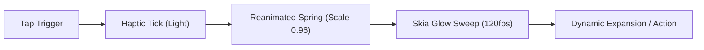

# MindMesh AI — Cyber-Luxury UI/UX Redesign Specification
*Inspired by [21st.dev](https://21st.dev/) & [Feral UI](https://feralui.dev/)*

---

## 🌌 1. Core Visual Identity & Design System

| Element | Specification | Visual Reference |
| :--- | :--- | :--- |
| **Background** | Deep Pitch-Black `#030308` with subtle radial gradient accents `#0D0D18` | Cyber-Luxury Minimalist |
| **Card Surfaces** | Frosted Glass: Semi-transparent `#0F111E`/`rgba(18, 20, 36, 0.7)` with `BlurView` backdrop | Feral UI Glassmorphism |
| **Border Accents** | 1px hairline border with Skia moving gradient sweep on focus/active state | 21st.dev Glowing Borders |
| **Synaptic Neons** | **Electric Cyan** (`#00F2FE`), **Neural Violet** (`#9D4EDD`), **Synaptic Blue** (`#4FACFE`), **Emerald AI** (`#00F5A0`) | Neural Palette |
| **Typography** | High-contrast sans-serif with tracked caps for tags and metadata | Modern brutalist monospace & clean geometric sans |
| **Elevations** | Diffused colored glow shadows (`shadowColor: '#9D4EDD'`, `shadowOpacity: 0.3`, `shadowRadius: 16`) | Ambient Backlight |

---

## ⚡ 2. Motion Physics & Micro-Interactions

1. **Spring Press Physics**: Every interactive touchable scales to `0.96` with `damping: 15, stiffness: 250` on touch down, snapping back with fluid inertia.
2. **Dynamic Border Glows**: Moving Skia gradient shader surrounding newly captured memories, focused cards, and AI processing skeletons.
3. **Tactile Haptic Layers (`expo-haptics`)**:
   - Button tap: `Haptics.impactAsync(Light)`
   - Memory captured / link saved: `Haptics.notificationAsync(Success)`
   - Audio recording start/stop: `Haptics.impactAsync(Medium)`
   - Deletion / destructive: `Haptics.notificationAsync(Warning)`
4. **Iridescent Skeleton Shimmer**: Multi-stop gradient sweep animation pulsating at 1.8s loop across placeholder cards while Gemini processes Vision and Audio.
5. **Particle Detach Transition**: Special transition when navigating between views where cards detach, drift with inertia, and morph fluidly.

---

## 🍱 3. Component Architecture & Phased Roadmap

### 📦 Step 1: Core Design System & Reusable Components *(Ready to start)*
- [x] **`src/theme/cyberLuxury.ts`**: Unified color tokens, typography scales, glass presets, and glow styles.
- [ ] **`src/components/ui/GlowCard.tsx`**: High-performance Reanimated + Skia card with frosted glass, 1px gradient border, and press spring physics.
- [ ] **`src/components/ui/SpringButton.tsx`**: Tactile interactive button with scale bouncing and customizable neon accents.
- [ ] **`src/components/ui/NeuralSkeleton.tsx`**: Iridescent animated shimmer skeleton for Vision/Audio processing.
- [ ] **`src/components/ui/SynapseBadge.tsx`**: Glowing holographic tag pill for memory context spaces (Work, Personal, Screenshot, etc.).

---

### 🍱 Step 2: Main Feed Dynamic Bento Grid
- [ ] **Staggered Masonry Layout**: Dynamic 2-column or 1-column responsive cards with varied aspect ratios based on media type:
  - **Screenshots & Images**: Edge-to-edge frosted frame with tap-to-inspect zoom.
  - **Voice Notes**: Compact card with embedded mini waveform preview.
  - **Links & Social**: Rich OpenGraph preview with favicon pill and domain label.
  - **AI Thoughts / Text**: Cyber-luxury typography card with synaptic tag pills.
- [ ] **Swipe & Context Actions**: Fluid swipe left/right for quick pin, summarize, share, and delete.

---

### 🎙️ Step 3: Floating Liquid Dock & Live Waveform Modal
- [ ] **Floating Liquid Dock (`src/components/CaptureBar.tsx`)**:
  - Suspended frosted glass capsule at bottom with spring-expanding action triggers (Voice, Photo, Link, Text).
- [ ] **Live Audio Waveform Modal**:
  - Bloom-up bottom sheet with real-time Skia amplitude bars reacting to microphone input during voice recording.

---

### 🔍 Step 4: 21st.dev Spotlight Command Palette
- [ ] **Frosted Blur Search Overlay**: Full-screen backdrop blur modal.
- [ ] **Instant Semantic Tag Filter**: Quick pill selection with animated layout transitions.
- [ ] **Real-time Fuzzy Memory Match**: Instant results with highlighted match text.

---

### 🧠 Step 5: Interactive Skia Neural Force Graph
- [ ] **Constellation Graph**: Connected nodes with pulsating synaptic energy lines rendered on Skia canvas.
- [ ] **Pinch-to-zoom & Node Drag Physics**: Interactive node physics with cluster focusing.
